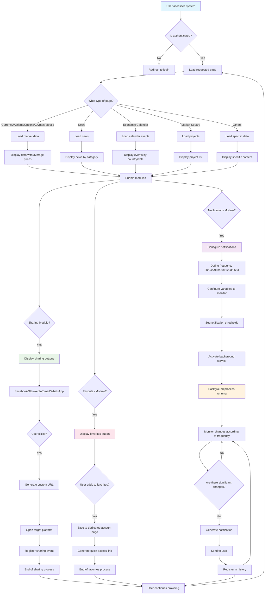

# Flowchart | Logical Functionality

## Logical Flow of Notification, Sharing and Favorites System

### Flow Description

**Main Flow:**

1. **Authentication**: User verification
2. **Page Loading**: Content type determination
3. **Data Loading**: Obtaining specific information according to type
4. **Module Enablement**: Functionality activation

**Notifications Module:**

-   Frequency configuration (3h, 24h, 96h, 30d, 120d, 365d)
-   Continuous background monitoring
-   Automatic notification generation

**Sharing Module:**

-   Multi-platform support
-   Click and engagement tracking
-   Custom URL generation

**Favorites Module:**

-   Management in dedicated account page
-   Quick access to favorite content
-   User preference persistence
