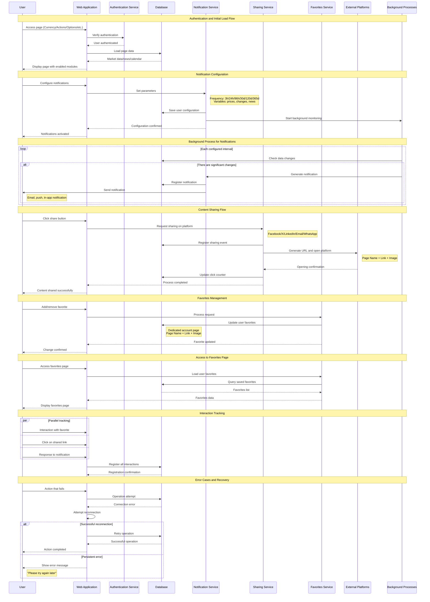

# Sequence Diagram | Interaction Flow

## Interaction Flow of Notification, Sharing and Favorites System

### Description of Interactions

**Main Actors:**

-   **User**: Interacts with the web application
-   **Web Application**: Frontend that handles requests
-   **Services**: Backend specialized by functionality
-   **Database**: Persistent storage
-   **Background Processes**: Automatic monitoring
-   **External Platforms**: Social networks and third-party services

**Key Flows:**

1. **Authentication and Loading**: User verification and data loading
2. **Notifications**: Configuration and automatic sending
3. **Sharing**: Integration with social platforms
4. **Favorites**: Preferred content management
5. **Tracking**: Interaction monitoring
6. **Error Handling**: Recovery from failures
