# Vertical Bar | User Management System

## Implementation of Vertical Bar for Notifications, Sharing and Favorites

```mermaid
flowchart TD
    A[User accesses the system] --> B{Is logged in?}

    B -->|YES - Logged User| C[Show Complete Vertical Bar]
    B -->|NO - Guest User| D[Show Vertical Bar + Registration Invitation]

    C --> C1[🔔 Notifications]
    C --> C2[📤 Share]
    C --> C3[⭐ Favorites]
    C --> C4[⚙️ Central Management Panel]

    D --> D1[🔔 Notifications]
    D --> D2[📤 Share]
    D --> D3[⭐ Favorites]
    D --> D4[📝 Registration Invitation]
    D --> D5[🍪 Cookie Management]

    %% Logged User - Notifications
    C1 --> C1A{Configure Notification?}
    C1A -->|Yes| C1B[Save to DB - notifications_config table]
    C1B --> C1C[Associate with user_id + page_id + module_id]
    C1C --> C1D[Configure frequency and variables]
    C1D --> C1E[Activate background service]

    %% Logged User - Favorites
    C3 --> C3A{Add to Favorites?}
    C3A -->|Yes| C3B[Save to DB - user_favorites table]
    C3B --> C3C[Associate with user_id + page_id]
    C3C --> C3D[Create quick access link]

    %% Logged User - Central Panel
    C4 --> C4A[Centralized Management]
    C4A --> C4B[View all active notifications]
    C4A --> C4C[Manage favorites by category]
    C4A --> C4D[Usage statistics]
    C4A --> C4E[Global configuration]

    %% Guest User - Notifications
    D1 --> D1A{Configure Notification?}
    D1A -->|Yes| D1B[Save to Browser Cookie]
    D1B --> D1C[JSON: page_id, module_id, config]
    D1C --> D1D[Limitation: Visual only, no persistence]

    %% Guest User - Favorites
    D3 --> D3A{Add to Favorites?}
    D3A -->|Yes| D3B[Save to Browser Cookie]
    D3B --> D3C[JSON: page_id, page_name, page_url]
    D3C --> D3D[Limitation: This browser only]

    %% Guest User - Cookie Management
    D5 --> D5A[Cookie View Panel]
    D5A --> D5B[📋 List active notifications]
    D5A --> D5C[📋 List saved favorites]
    D5A --> D5D[⚠️ No central management capability]
    D5D --> D5E[Must manage from each page/module]

    %% Registration Invitation
    D4 --> D4A[💡 Invitation Banner]
    D4A --> D4B[Registration benefits:]
    D4B --> D4C[✅ Centralized management]
    D4B --> D4D[✅ Cross-device synchronization]
    D4B --> D4E[✅ Permanent history]
    D4B --> D4F[✅ Email/push notifications]

    %% Share (same for both)
    C2 --> ShareFlow[Share Process]
    D2 --> ShareFlow
    ShareFlow --> SF1[Select platform]
    ShareFlow --> SF2[Generate custom URL]
    ShareFlow --> SF3[Open share window]
    ShareFlow --> SF4[Log event]

    %% Cookie to DB Conversion
    D5E --> ConversionFlow{User registers?}
    ConversionFlow -->|Yes| CF1[Migrate cookie data to DB]
    CF1 --> CF2[Transfer configured notifications]
    CF1 --> CF3[Transfer saved favorites]
    CF1 --> CF4[Clear cookies]
    CF1 --> CF5[Activate full management]

    %% Styles
    classDef loggedUser fill:#e1f5fe,stroke:#01579b,stroke-width:2px
    classDef guestUser fill:#fff3e0,stroke:#e65100,stroke-width:2px
    classDef database fill:#f3e5f5,stroke:#4a148c,stroke-width:2px
    classDef cookies fill:#fff8e1,stroke:#ff8f00,stroke-width:2px
    classDef invitation fill:#e8f5e8,stroke:#2e7d32,stroke-width:2px

    class C,C1,C2,C3,C4,C1A,C1B,C1C,C1D,C1E,C3A,C3B,C3C,C3D,C4A,C4B,C4C,C4D,C4E loggedUser
    class D,D1,D2,D3,D5,D1A,D1B,D1C,D1D,D3A,D3B,D3C,D3D,D5A,D5B,D5C,D5D,D5E guestUser
    class C1B,C1C,C3B,C3C,CF1,CF2,CF3 database
    class D1B,D1C,D3B,D3C,D5A,D5B,D5C cookies
    class D4,D4A,D4B,D4C,D4D,D4E,D4F invitation
```



## Data Structure

### For Logged User (Database)

#### Table: user_notification_configs

```sql
- id (PK)
- user_id (FK)
- page_id (FK)
- module_id (FK)
- frequency (3h, 24h, 96h, 30d, 120d, 365d)
- variables (JSON)
- is_active (boolean)
- created_at
- updated_at
```

#### Table: user_favorites

```sql
- id (PK)
- user_id (FK)
- page_id (FK)
- page_name
- page_url
- image_url
- category
- is_active (boolean)
- created_at
```

### For Guest User (Cookies)

#### Cookie: notification_configs

```json
{
	"configs": [
		{
			"page_id": "currency_main",
			"module": "notifications",
			"frequency": "3h",
			"variables": [
				"spot_price",
				"high_low"
			],
			"timestamp": "2025-06-18T10:00:00Z"
		}
	]
}
```

#### Cookie: user_favorites

```json
{
	"favorites": [
		{
			"page_id": "currency_eur_usd",
			"page_name": "EUR/USD",
			"page_url": "/currency/eur-usd",
			"image_url": "/images/eur-usd.jpg",
			"timestamp": "2025-06-18T10:00:00Z"
		}
	]
}
```

## Implementation Features

### Vertical Bar - Fixed Position

-   **Location**: Right or left side of screen
-   **Behavior**: Sticky/Fixed position
-   **Responsive**: Collapsible on mobile
-   **Access**: Visible on all system pages

### Functional Differences

| Feature                | Logged User    | Guest User                |
| ---------------------- | -------------- | ------------------------- |
| **Storage**            | MySQL database | Browser cookies           |
| **Persistence**        | Permanent      | Temporary (until cleanup) |
| **Synchronization**    | Cross-device   | Current device only       |
| **Central Management** | Full panel     | View only                 |
| **Capabilities**       | Complete       | Limited                   |
| **Migration**          | N/A            | Automatic on registration |

### Conversion Flow

1. Guest user configures notifications/favorites → Cookies
2. User decides to register → Registration process
3. System detects existing cookies → Automatic migration
4. Data transferred to DB → Cookies cleared
5. User accesses full management → Enhanced experience
