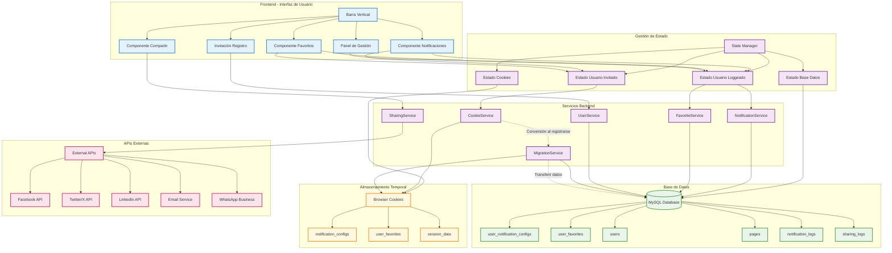
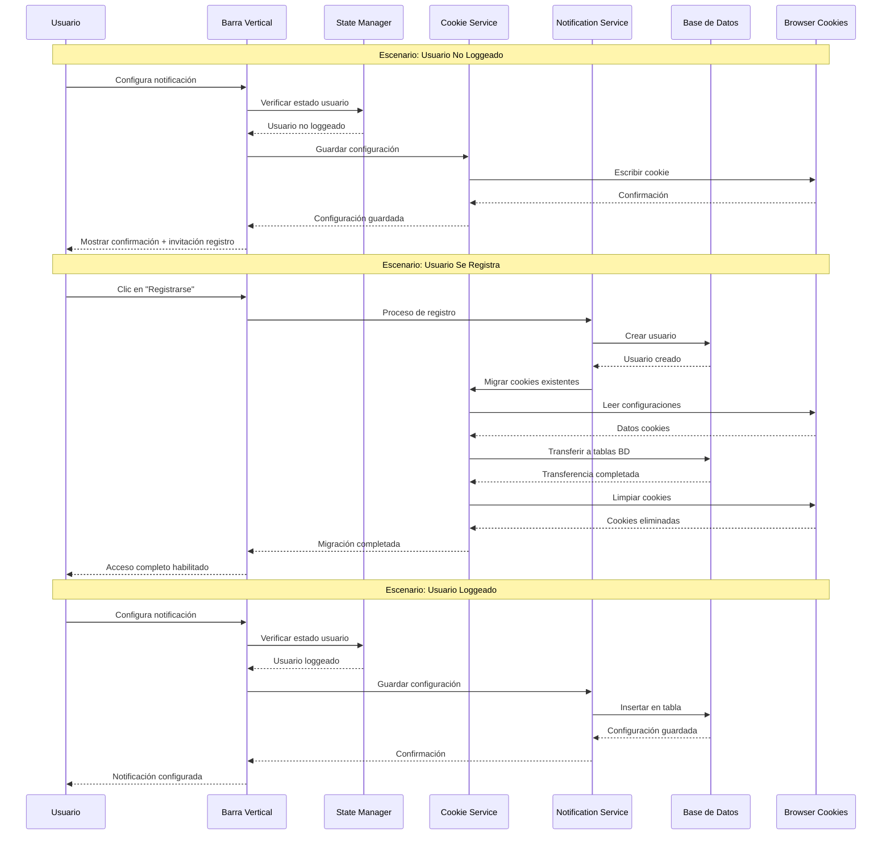

# Arquitectura Técnica | Barra Vertical

## Diagrama de Arquitectura del Sistema de Barra Vertical



## Flujo de Datos Detallado



## Especificaciones Técnicas

### Componentes Frontend (JavaScript/Twig)

#### Barra Vertical Component

```javascript
class VerticalBar {
	constructor() {
		this.userState =
			null;
		this.cookieService =
			new CookieService();
		this.notificationService =
			new NotificationService();
		this.favoriteService =
			new FavoriteService();
	}

	async initialize() {
		this.userState =
			await this.checkUserState();
		this.render();
		this.attachEventListeners();
	}

	render() {
		// Renderizar según estado del usuario
		if (
			this
				.userState
				.isLoggedIn
		) {
			this.renderLoggedUserBar();
		} else {
			this.renderGuestUserBar();
		}
	}
}
```

### Servicios Backend (Symfony 6.4)

#### NotificationService

```php
class NotificationService
{
    public function saveConfiguration(User $user, array $config): void
    {
        $notificationConfig = new UserNotificationConfig();
        $notificationConfig->setUser($user);
        $notificationConfig->setPageId($config['page_id']);
        $notificationConfig->setModuleId($config['module_id']);
        $notificationConfig->setFrequency($config['frequency']);
        $notificationConfig->setVariables($config['variables']);

        $this->entityManager->persist($notificationConfig);
        $this->entityManager->flush();
    }
}
```

#### CookieService

```php
class CookieService
{
    public function saveNotificationConfig(array $config): void
    {
        $existingConfigs = $this->getNotificationConfigs();
        $existingConfigs[] = $config;

        setcookie(
            'notification_configs',
            json_encode(['configs' => $existingConfigs]),
            time() + (86400 * 30), // 30 días
            '/',
            null,
            true,
            true
        );
    }

    public function migrateCookiesToDatabase(User $user): void
    {
        $notificationConfigs = $this->getNotificationConfigs();
        $favorites = $this->getFavoriteConfigs();

        foreach ($notificationConfigs as $config) {
            $this->notificationService->saveConfiguration($user, $config);
        }

        foreach ($favorites as $favorite) {
            $this->favoriteService->saveFavorite($user, $favorite);
        }

        $this->clearAllCookies();
    }
}
```

### Estructura de Base de Datos

#### user_notification_configs

```sql
CREATE TABLE user_notification_configs (
    id INT AUTO_INCREMENT PRIMARY KEY,
    user_id INT NOT NULL,
    page_id VARCHAR(50) NOT NULL,
    module_id VARCHAR(50) NOT NULL,
    frequency ENUM('3h', '24h', '96h', '30d', '120d', '365d') NOT NULL,
    variables JSON NOT NULL,
    is_active BOOLEAN DEFAULT TRUE,
    created_at TIMESTAMP DEFAULT CURRENT_TIMESTAMP,
    updated_at TIMESTAMP DEFAULT CURRENT_TIMESTAMP ON UPDATE CURRENT_TIMESTAMP,
    FOREIGN KEY (user_id) REFERENCES users(id) ON DELETE CASCADE,
    INDEX idx_user_active (user_id, is_active),
    INDEX idx_page_module (page_id, module_id)
);
```

#### user_favorites

```sql
CREATE TABLE user_favorites (
    id INT AUTO_INCREMENT PRIMARY KEY,
    user_id INT NOT NULL,
    page_id VARCHAR(50) NOT NULL,
    page_name VARCHAR(255) NOT NULL,
    page_url VARCHAR(500) NOT NULL,
    image_url VARCHAR(500),
    category VARCHAR(50),
    is_active BOOLEAN DEFAULT TRUE,
    created_at TIMESTAMP DEFAULT CURRENT_TIMESTAMP,
    FOREIGN KEY (user_id) REFERENCES users(id) ON DELETE CASCADE,
    UNIQUE KEY unique_user_page (user_id, page_id),
    INDEX idx_user_category (user_id, category),
    INDEX idx_user_active (user_id, is_active)
);
```

### Consideraciones de Rendimiento

1. **Cache Redis**: Para configuraciones de usuario frecuentemente accedidas
2. **Lazy Loading**: Cargar componentes de la barra bajo demanda
3. **Debouncing**: Para evitar múltiples requests en configuraciones rápidas
4. **Batch Operations**: Agrupar operaciones de migración de cookies
5. **CDN**: Para recursos estáticos de la barra vertical
