# Barra Vertical | Sistema de Gestión de Usuario

## Implementación de Barra Vertical para Notificaciones, Compartir y Favoritos

```mermaid
flowchart TD
    A[Usuario accede al sistema] --> B{¿Está loggeado?}

    B -->|SÍ - Usuario Loggeado| C[Mostrar Barra Vertical Completa]
    B -->|NO - Usuario No Loggeado| D[Mostrar Barra Vertical + Invitación a Registro]

    C --> C1[🔔 Notificaciones]
    C --> C2[📤 Compartir]
    C --> C3[⭐ Favoritos]
    C --> C4[⚙️ Panel de Gestión Central]

    D --> D1[🔔 Notificaciones]
    D --> D2[📤 Compartir]
    D --> D3[⭐ Favoritos]
    D --> D4[📝 Invitación a Registro]
    D --> D5[🍪 Gestión por Cookies]

    %% Usuario Loggeado - Notificaciones
    C1 --> C1A{¿Configurar Notificación?}
    C1A -->|Sí| C1B[Guardar en BD - tabla notifications_config]
    C1B --> C1C[Asociar con user_id + page_id + module_id]
    C1C --> C1D[Configurar frecuencia y variables]
    C1D --> C1E[Activar servicio background]

    %% Usuario Loggeado - Favoritos
    C3 --> C3A{¿Añadir a Favoritos?}
    C3A -->|Sí| C3B[Guardar en BD - tabla user_favorites]
    C3B --> C3C[Asociar con user_id + page_id]
    C3C --> C3D[Crear enlace de acceso rápido]

    %% Usuario Loggeado - Panel Central
    C4 --> C4A[Gestión Centralizada]
    C4A --> C4B[Ver todas las notificaciones activas]
    C4A --> C4C[Gestionar favoritos por categoría]
    C4A --> C4D[Estadísticas de uso]
    C4A --> C4E[Configuración global]

    %% Usuario No Loggeado - Notificaciones
    D1 --> D1A{¿Configurar Notificación?}
    D1A -->|Sí| D1B[Guardar en Cookie del navegador]
    D1B --> D1C[JSON: page_id, module_id, config]
    D1C --> D1D[Limitación: Solo visual, sin persistencia]

    %% Usuario No Loggeado - Favoritos
    D3 --> D3A{¿Añadir a Favoritos?}
    D3A -->|Sí| D3B[Guardar en Cookie del navegador]
    D3B --> D3C[JSON: page_id, page_name, page_url]
    D3C --> D3D[Limitación: Solo en este navegador]

    %% Usuario No Loggeado - Gestión por Cookies
    D5 --> D5A[Panel de Vista de Cookies]
    D5A --> D5B[📋 Listar notificaciones activas]
    D5A --> D5C[📋 Listar favoritos guardados]
    D5A --> D5D[⚠️ Sin capacidad de gestión central]
    D5D --> D5E[Debe gestionar desde cada página/módulo]

    %% Invitación a Registro
    D4 --> D4A[💡 Banner de Invitación]
    D4A --> D4B[Ventajas del registro:]
    D4B --> D4C[✅ Gestión centralizada]
    D4B --> D4D[✅ Sincronización entre dispositivos]
    D4B --> D4E[✅ Historial permanente]
    D4B --> D4F[✅ Notificaciones por email/push]

    %% Compartir (igual para ambos)
    C2 --> ShareFlow[Proceso de Compartir]
    D2 --> ShareFlow
    ShareFlow --> SF1[Seleccionar plataforma]
    ShareFlow --> SF2[Generar URL personalizada]
    ShareFlow --> SF3[Abrir ventana de compartir]
    ShareFlow --> SF4[Registrar evento]

    %% Conversión de Cookie a BD
    D5E --> ConversionFlow{¿Usuario se registra?}
    ConversionFlow -->|Sí| CF1[Migrar datos de cookies a BD]
    CF1 --> CF2[Transferir notificaciones configuradas]
    CF1 --> CF3[Transferir favoritos guardados]
    CF1 --> CF4[Limpiar cookies]
    CF1 --> CF5[Activar gestión completa]

    %% Estilos
    classDef loggedUser fill:#e1f5fe,stroke:#01579b,stroke-width:2px
    classDef guestUser fill:#fff3e0,stroke:#e65100,stroke-width:2px
    classDef database fill:#f3e5f5,stroke:#4a148c,stroke-width:2px
    classDef cookies fill:#fff8e1,stroke:#ff8f00,stroke-width:2px
    classDef invitation fill:#e8f5e8,stroke:#2e7d32,stroke-width:2px

    class C,C1,C2,C3,C4,C1A,C1B,C1C,C1D,C1E,C3A,C3B,C3C,C3D,C4A,C4B,C4C,C4D,C4E loggedUser
    class D,D1,D2,D3,D5,D1A,D1B,D1C,D1D,D3A,D3B,D3C,D3D,D5A,D5B,D5C,D5D,D5E guestUser
    class C1B,C1C,C3B,C3C,CF1,CF2,CF3 database
    class D1B,D1C,D3B,D3C,D5A,D5B,D5C cookies
    class D4,D4A,D4B,D4C,D4D,D4E,D4F invitation
```



## Estructura de Datos

### Para Usuario Loggeado (Base de Datos)

#### Tabla: user_notification_configs

```sql
- id (PK)
- user_id (FK)
- page_id (FK)
- module_id (FK)
- frequency (3h, 24h, 96h, 30d, 120d, 365d)
- variables (JSON)
- is_active (boolean)
- created_at
- updated_at
```

#### Tabla: user_favorites

```sql
- id (PK)
- user_id (FK)
- page_id (FK)
- page_name
- page_url
- image_url
- category
- is_active (boolean)
- created_at
```

### Para Usuario No Loggeado (Cookies)

#### Cookie: notification_configs

```json
{
	"configs": [
		{
			"page_id": "currency_main",
			"module": "notifications",
			"frequency": "3h",
			"variables": [
				"spot_price",
				"high_low"
			],
			"timestamp": "2025-06-18T10:00:00Z"
		}
	]
}
```

#### Cookie: user_favorites

```json
{
	"favorites": [
		{
			"page_id": "currency_eur_usd",
			"page_name": "EUR/USD",
			"page_url": "/currency/eur-usd",
			"image_url": "/images/eur-usd.jpg",
			"timestamp": "2025-06-18T10:00:00Z"
		}
	]
}
```

## Características de la Implementación

### Barra Vertical - Posición Fija

-   **Ubicación**: Lado derecho o izquierdo de la pantalla
-   **Comportamiento**: Sticky/Fixed position
-   **Responsive**: Colapsable en móviles
-   **Acceso**: Visible en todas las páginas del sistema

### Diferencias Funcionales

| Característica      | Usuario Loggeado    | Usuario No Loggeado       |
| ------------------- | ------------------- | ------------------------- |
| **Almacenamiento**  | Base de datos MySQL | Cookies del navegador     |
| **Persistencia**    | Permanente          | Temporal (hasta limpieza) |
| **Sincronización**  | Entre dispositivos  | Solo dispositivo actual   |
| **Gestión Central** | Panel completo      | Solo visualización        |
| **Capacidades**     | Completas           | Limitadas                 |
| **Migración**       | N/A                 | Automática al registrarse |

### Flujo de Conversión

1. Usuario no loggeado configura notificaciones/favoritos → Cookies
2. Usuario decide registrarse → Proceso de registro
3. Sistema detecta cookies existentes → Migración automática
4. Datos se transfieren a BD → Cookies se limpian
5. Usuario accede a gestión completa → Experiencia mejorada
