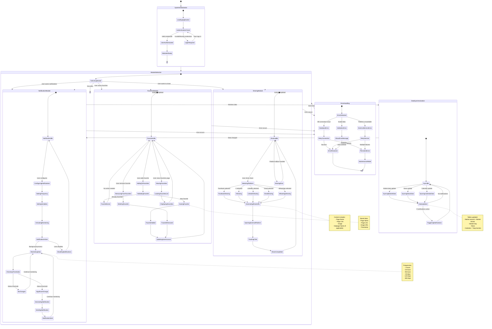

# State Diagram | Functional State of Modules

## Estados Funcionales de los Módulos del Sistema

### Descripción de Estados

**Estados del Sistema:**

-   **SystemInitialization**: Carga inicial y autenticación
-   **ModuleSelection**: Selección de funcionalidad por el usuario
-   **DataSynchronization**: Sincronización de datos en background
-   **ErrorHandling**: Manejo de errores y recuperación

**Estados de Módulos:**

1. **NotificationModule**: Gestión de notificaciones con monitoreo continuo
2. **SharingModule**: Proceso de compartir en plataformas sociales
3. **FavoritesModule**: Administración de contenido favorito

**Transiciones Clave:**

-   Activación/desactivación de módulos por el usuario
-   Monitoreo automático de datos para notificaciones
-   Manejo de errores con reintentos automáticos
-   Sincronización continua de datos de mercado, noticias y calendario
