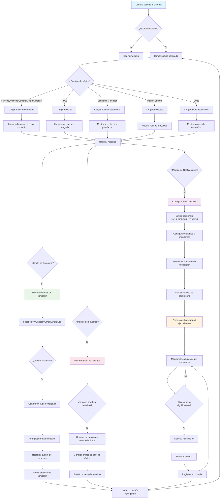

# Flowchart | Logical Functionality

## Flujo Lógico del Sistema de Notificaciones, Compartir y Favoritos

### Descripción del Flujo

**Flujo Principal:**

1. **Autenticación**: Verificación de usuario
2. **Carga de Página**: Determinación del tipo de contenido
3. **Carga de Datos**: Obtención de información específica según el tipo
4. **Habilitación de Módulos**: Activación de funcionalidades

**Módulo de Notificaciones:**

-   Configuración de frecuencias (3h, 24h, 96h, 30d, 120d, 365d)
-   Monitoreo continuo en background
-   Generación automática de notificaciones

**Módulo de Compartir:**

-   Soporte para múltiples plataformas
-   Tracking de clicks y engagement
-   Generación de URLs personalizadas

**Módulo de Favoritos:**

-   Gestión en página de cuenta dedicada
-   Acceso rápido a contenido favorito
-   Persistencia de preferencias de usuario
