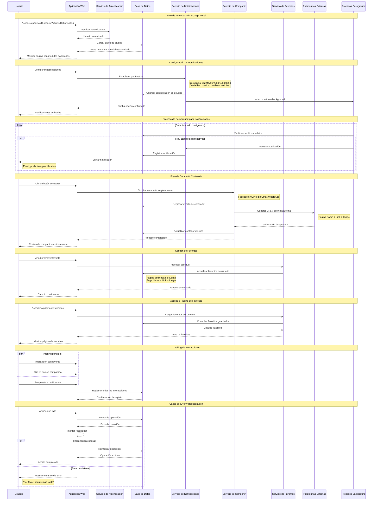

# Sequence Diagram | Interaction Flow

## Flujo de Interacciones del Sistema de Notificaciones, Compartir y Favoritos

### Descripción de las Interacciones

**Actores Principales:**

-   **Usuario**: Interactúa con la aplicación web
-   **Aplicación Web**: Frontend que maneja las solicitudes
-   **Servicios**: Backend especializado por funcionalidad
-   **Base de Datos**: Almacenamiento persistente
-   **Procesos Background**: Monitoreo automático
-   **Plataformas Externas**: Redes sociales y servicios de terceros

**Flujos Clave:**

1. **Autenticación y Carga**: Verificación de usuario y carga de datos
2. **Notificaciones**: Configuración y envío automático
3. **Compartir**: Integración con plataformas sociales
4. **Favoritos**: Gestión de contenido preferido
5. **Tracking**: Seguimiento de interacciones
6. **Manejo de Errores**: Recuperación ante fallos
