# TD Graph | Node-Node Simple Relations

## Relaciones Simples Nodo-Nodo del Sistema

```mermaid
graph TD
    %% Nodos de Páginas Principales
    A[Currency Pages]
    B[Actions Pages]
    C[Options Pages]
    D[Cryptos Pages]
    E[Metals Pages]
    F[News Pages]
    G[Economic Calendar]
    H[Market Square]
    I[Supplier/Customer]
    J[Legal Information]
    K[Sector Analysis]
    L[Financial Indicators]
    M[Leaders]
    N[International Trade]
    O[Development Aid]
    P[Country Indicators]

    %% Nodos de Módulos Core
    Q[Notification Module]
    R[Sharing Module]
    S[Favorites Module]

    %% Nodos de Datos
    T[Market Data]
    U[News Data]
    V[Calendar Data]
    W[Company Data]
    X[Trade Data]
    Y[Financial Data]

    %% Nodos de Usuarios y Servicios
    Z[User Account]
    AA[Background Services]
    BB[External Platforms]
    CC[Database]
    DD[Service Provider]

    %% Nodos de Frecuencias
    EE[3 Hours]
    FF[24 Hours]
    GG[96 Hours]
    HH[30 Days]
    II[120 Days]
    JJ[365 Days]

    %% Relaciones de Páginas a Módulos
    A --> Q
    A --> R
    A --> S
    B --> Q
    B --> R
    B --> S
    C --> Q
    C --> R
    C --> S
    D --> Q
    D --> R
    D --> S
    E --> Q
    E --> R
    E --> S
    F --> Q
    F --> R
    F --> S
    G --> Q
    G --> R
    G --> S
    H --> Q
    H --> R
    H --> S
    I --> Q
    I --> R
    I --> S
    J --> Q
    J --> R
    J --> S
    K --> Q
    K --> R
    K --> S
    L --> Q
    L --> R
    L --> S
    M --> Q
    M --> R
    M --> S
    N --> Q
    N --> R
    N --> S
    O --> Q
    O --> R
    O --> S
    P --> Q
    P --> R
    P --> S

    %% Relaciones de Datos a Páginas
    T --> A
    T --> B
    T --> C
    T --> D
    T --> E
    U --> F
    V --> G
    W --> H
    W --> I
    W --> J
    Y --> K
    Y --> L
    W --> M
    X --> N
    Y --> O
    Y --> P

    %% Relaciones de Módulos a Servicios
    Q --> AA
    Q --> CC
    R --> BB
    R --> DD
    S --> Z
    S --> CC

    %% Relaciones de Frecuencias a Notificaciones
    EE --> Q
    FF --> Q
    GG --> Q
    HH --> Q
    II --> Q
    JJ --> Q

    %% Relaciones de Usuario
    Z --> Q
    Z --> R
    Z --> S
    Z --> CC

    %% Relaciones de Servicios Background
    AA --> T
    AA --> U
    AA --> V
    AA --> W
    AA --> X
    AA --> Y

    %% Relaciones de Plataformas Externas
    BB --> KK[Facebook]
    BB --> LL[X/Twitter]
    BB --> MM[LinkedIn]
    BB --> NN[Email]
    BB --> OO[WhatsApp]

    %% Estilos de Nodos
    classDef pageNode fill:#e3f2fd,stroke:#1976d2,stroke-width:2px
    classDef moduleNode fill:#f3e5f5,stroke:#7b1fa2,stroke-width:2px
    classDef dataNode fill:#e8f5e8,stroke:#388e3c,stroke-width:2px
    classDef serviceNode fill:#fff3e0,stroke:#f57c00,stroke-width:2px
    classDef frequencyNode fill:#fce4ec,stroke:#c2185b,stroke-width:2px
    classDef platformNode fill:#e0f2f1,stroke:#00695c,stroke-width:2px

    %% Aplicar estilos
    class A,B,C,D,E,F,G,H,I,J,K,L,M,N,O,P pageNode
    class Q,R,S moduleNode
    class T,U,V,W,X,Y dataNode
    class Z,AA,BB,CC,DD serviceNode
    class EE,FF,GG,HH,II,JJ frequencyNode
    class KK,LL,MM,NN,OO platformNode

    %% Subgrafos para organización
    subgraph "Market Pages"
        A
        B
        C
        D
        E
    end

    subgraph "Information Pages"
        F
        G
        H
        I
    end

    subgraph "Analysis Pages"
        J
        K
        L
        M
        N
        O
        P
    end

    subgraph "Core Modules"
        Q
        R
        S
    end

    subgraph "Data Sources"
        T
        U
        V
        W
        X
        Y
    end

    subgraph "System Services"
        Z
        AA
        BB
        CC
        DD
    end

    subgraph "Notification Frequencies"
        EE
        FF
        GG
        HH
        II
        JJ
    end

    subgraph "Social Platforms"
        KK
        LL
        MM
        NN
        OO
    end
```

### Descripción de Relaciones Nodo-Nodo

**Relaciones Principales:**

1. **Páginas → Módulos**: Todas las páginas del sistema se conectan a los tres módulos core (Notificaciones, Compartir, Favoritos)

2. **Datos → Páginas**: Diferentes tipos de datos alimentan páginas específicas:

    - Market Data → Currency, Actions, Options, Cryptos, Metals
    - News Data → News Pages
    - Calendar Data → Economic Calendar
    - Company Data → Market Square, Supplier/Customer, Legal Info, Leaders
    - Financial Data → Sector Analysis, Financial Indicators, Development Aid, Country Indicators
    - Trade Data → International Trade

3. **Módulos → Servicios**:

    - Notification Module → Background Services + Database
    - Sharing Module → External Platforms + Service Provider
    - Favorites Module → User Account + Database

4. **Frecuencias → Notificaciones**: Seis intervalos de tiempo diferentes se conectan al módulo de notificaciones

5. **Usuario → Sistema**: El usuario se conecta a todos los módulos y la base de datos

6. **Servicios Background → Datos**: Los servicios de background monitean todos los tipos de datos

7. **Plataformas Externas**: Facebook, X, LinkedIn, Email, WhatsApp se conectan a través del módulo de compartir

**Características del Grafo:**

-   **Nodos de Páginas** (azul): 16 tipos diferentes de páginas
-   **Nodos de Módulos** (morado): 3 módulos core del sistema
-   **Nodos de Datos** (verde): 6 tipos de fuentes de datos
-   **Nodos de Servicios** (naranja): 5 servicios del sistema
-   **Nodos de Frecuencias** (rosa): 6 intervalos de notificación
-   **Nodos de Plataformas** (teal): 5 plataformas sociales/comunicación
