# Barre Verticale | Système de Gestion Utilisateur

## Implémentation de la Barre Verticale pour Notifications, Partage et Favoris

```mermaid
flowchart TD
    A[Utilisateur accède au système] --> B{Est-il connecté?}

    B -->|OUI - Utilisateur Connecté| C[Afficher Barre Verticale Complète]
    B -->|NON - Utilisateur Invité| D[Afficher Barre Verticale + Invitation Inscription]

    C --> C1[🔔 Notifications]
    C --> C2[📤 Partager]
    C --> C3[⭐ Favoris]
    C --> C4[⚙️ Panneau de Gestion Central]

    D --> D1[🔔 Notifications]
    D --> D2[📤 Partager]
    D --> D3[⭐ Favoris]
    D --> D4[📝 Invitation à l'Inscription]
    D --> D5[🍪 Gestion par Cookies]

    %% Utilisateur Connecté - Notifications
    C1 --> C1A{Configurer Notification?}
    C1A -->|Oui| C1B[Sauvegarder en BD - table notifications_config]
    C1B --> C1C[Associer avec user_id + page_id + module_id]
    C1C --> C1D[Configurer fréquence et variables]
    C1D --> C1E[Activer service d'arrière-plan]

    %% Utilisateur Connecté - Favoris
    C3 --> C3A{Ajouter aux Favoris?}
    C3A -->|Oui| C3B[Sauvegarder en BD - table user_favorites]
    C3B --> C3C[Associer avec user_id + page_id]
    C3C --> C3D[Créer lien d'accès rapide]

    %% Utilisateur Connecté - Panneau Central
    C4 --> C4A[Gestion Centralisée]
    C4A --> C4B[Voir toutes les notifications actives]
    C4A --> C4C[Gérer favoris par catégorie]
    C4A --> C4D[Statistiques d'utilisation]
    C4A --> C4E[Configuration globale]

    %% Utilisateur Invité - Notifications
    D1 --> D1A{Configurer Notification?}
    D1A -->|Oui| D1B[Sauvegarder dans Cookie navigateur]
    D1B --> D1C[JSON: page_id, module_id, config]
    D1C --> D1D[Limitation: Visuel seulement, sans persistance]

    %% Utilisateur Invité - Favoris
    D3 --> D3A{Ajouter aux Favoris?}
    D3A -->|Oui| D3B[Sauvegarder dans Cookie navigateur]
    D3B --> D3C[JSON: page_id, page_name, page_url]
    D3C --> D3D[Limitation: Ce navigateur uniquement]

    %% Utilisateur Invité - Gestion Cookies
    D5 --> D5A[Panneau de Vue Cookies]
    D5A --> D5B[📋 Lister notifications actives]
    D5A --> D5C[📋 Lister favoris sauvegardés]
    D5A --> D5D[⚠️ Pas de capacité de gestion centrale]
    D5D --> D5E[Doit gérer depuis chaque page/module]

    %% Invitation à l'Inscription
    D4 --> D4A[💡 Bannière d'Invitation]
    D4A --> D4B[Avantages de l'inscription:]
    D4B --> D4C[✅ Gestion centralisée]
    D4B --> D4D[✅ Synchronisation multi-appareils]
    D4B --> D4E[✅ Historique permanent]
    D4B --> D4F[✅ Notifications email/push]

    %% Partager (identique pour les deux)
    C2 --> ShareFlow[Processus de Partage]
    D2 --> ShareFlow
    ShareFlow --> SF1[Sélectionner plateforme]
    ShareFlow --> SF2[Générer URL personnalisée]
    ShareFlow --> SF3[Ouvrir fenêtre de partage]
    ShareFlow --> SF4[Enregistrer événement]

    %% Conversion Cookie vers BD
    D5E --> ConversionFlow{Utilisateur s'inscrit?}
    ConversionFlow -->|Oui| CF1[Migrer données cookies vers BD]
    CF1 --> CF2[Transférer notifications configurées]
    CF1 --> CF3[Transférer favoris sauvegardés]
    CF1 --> CF4[Nettoyer cookies]
    CF1 --> CF5[Activer gestion complète]

    %% Styles
    classDef loggedUser fill:#e1f5fe,stroke:#01579b,stroke-width:2px
    classDef guestUser fill:#fff3e0,stroke:#e65100,stroke-width:2px
    classDef database fill:#f3e5f5,stroke:#4a148c,stroke-width:2px
    classDef cookies fill:#fff8e1,stroke:#ff8f00,stroke-width:2px
    classDef invitation fill:#e8f5e8,stroke:#2e7d32,stroke-width:2px

    class C,C1,C2,C3,C4,C1A,C1B,C1C,C1D,C1E,C3A,C3B,C3C,C3D,C4A,C4B,C4C,C4D,C4E loggedUser
    class D,D1,D2,D3,D5,D1A,D1B,D1C,D1D,D3A,D3B,D3C,D3D,D5A,D5B,D5C,D5D,D5E guestUser
    class C1B,C1C,C3B,C3C,CF1,CF2,CF3 database
    class D1B,D1C,D3B,D3C,D5A,D5B,D5C cookies
    class D4,D4A,D4B,D4C,D4D,D4E,D4F invitation
```



## Structure des Données

### Pour Utilisateur Connecté (Base de Données)

#### Table: user_notification_configs

```sql
- id (PK)
- user_id (FK)
- page_id (FK)
- module_id (FK)
- frequency (3h, 24h, 96h, 30d, 120d, 365d)
- variables (JSON)
- is_active (boolean)
- created_at
- updated_at
```

#### Table: user_favorites

```sql
- id (PK)
- user_id (FK)
- page_id (FK)
- page_name
- page_url
- image_url
- category
- is_active (boolean)
- created_at
```

### Pour Utilisateur Invité (Cookies)

#### Cookie: notification_configs

```json
{
	"configs": [
		{
			"page_id": "currency_main",
			"module": "notifications",
			"frequency": "3h",
			"variables": [
				"spot_price",
				"high_low"
			],
			"timestamp": "2025-06-18T10:00:00Z"
		}
	]
}
```

#### Cookie: user_favorites

```json
{
	"favorites": [
		{
			"page_id": "currency_eur_usd",
			"page_name": "EUR/USD",
			"page_url": "/currency/eur-usd",
			"image_url": "/images/eur-usd.jpg",
			"timestamp": "2025-06-18T10:00:00Z"
		}
	]
}
```

## Caractéristiques de l'Implémentation

### Barre Verticale - Position Fixe

-   **Emplacement**: Côté droit ou gauche de l'écran
-   **Comportement**: Position sticky/fixe
-   **Responsive**: Repliable sur mobile
-   **Accès**: Visible sur toutes les pages du système

### Différences Fonctionnelles

| Caractéristique      | Utilisateur Connecté  | Utilisateur Invité                |
| -------------------- | --------------------- | --------------------------------- |
| **Stockage**         | Base de données MySQL | Cookies du navigateur             |
| **Persistance**      | Permanente            | Temporaire (jusqu'au nettoyage)   |
| **Synchronisation**  | Multi-appareils       | Appareil actuel uniquement        |
| **Gestion Centrale** | Panneau complet       | Visualisation seulement           |
| **Capacités**        | Complètes             | Limitées                          |
| **Migration**        | N/A                   | Automatique lors de l'inscription |

### Flux de Conversion

1. Utilisateur invité configure notifications/favoris → Cookies
2. Utilisateur décide de s'inscrire → Processus d'inscription
3. Système détecte cookies existants → Migration automatique
4. Données transférées vers BD → Cookies nettoyés
5. Utilisateur accède à la gestion complète → Expérience améliorée
