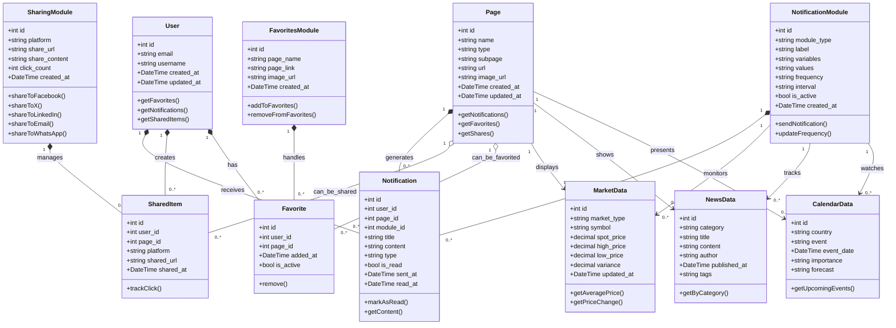

# Diagramme de Classes | Modèles et Relations

## Système de Notifications, Partage et Favoris pour Symfony 6.4

### Descripción de las Relaciones

-   **User**: Usuario del sistema que puede recibir notificaciones, compartir contenido y marcar favoritos
-   **Page**: Páginas del sistema (Currency, Actions, Options, Cryptos, Metals, News, etc.)
-   **NotificationModule**: Gestiona las notificaciones con diferentes frecuencias e intervalos
-   **SharingModule**: Maneja el compartir en redes sociales y otras plataformas
-   **FavoritesModule**: Administra el sistema de favoritos de usuario
-   **MarketData/NewsData/CalendarData**: Datos específicos que alimentan las notificaciones
