# Diagramme d'États | État Fonctionnel des Modules

## États Fonctionnels des Modules du Système

```mermaid
stateDiagram-v2
    [*] --> SystemInitialization

    state SystemInitialization {
        [*] --> LoadingApplication
        LoadingApplication --> AuthenticationCheck
        AuthenticationCheck --> UserAuthenticated : Identifiants valides
        AuthenticationCheck --> LoginRequired : Identifiants invalides/manquants
        LoginRequired --> AuthenticationCheck : L'utilisateur se connecte
        UserAuthenticated --> ModulesReady
        ModulesReady --> [*]
    }

    SystemInitialization --> ModuleSelection

    state ModuleSelection {
        [*] --> SelectingModule
        SelectingModule --> NotificationModule : L'utilisateur veut des notifications
        SelectingModule --> SharingModule : L'utilisateur veut partager
        SelectingModule --> FavoritesModule : L'utilisateur veut des favoris
        SelectingModule --> [*] : Aucune action
    }

    state NotificationModule {
        [*] --> NotificationIdle
        NotificationIdle --> ConfiguringNotifications : L'utilisateur configure
        ConfiguringNotifications --> SettingFrequency
        SettingFrequency --> SettingVariables
        SettingVariables --> ActivatingMonitoring
        ActivatingMonitoring --> NotificationActive

        NotificationActive --> MonitoringData : Processus en arrière-plan
        MonitoringData --> CheckingThresholds
        CheckingThresholds --> NoChanges : En dessous du seuil
        CheckingThresholds --> SignificantChange : Au-dessus du seuil

        NoChanges --> MonitoringData : Continuer la surveillance
        SignificantChange --> GeneratingNotification
        GeneratingNotification --> SendingNotification
        SendingNotification --> NotificationSent
        NotificationSent --> MonitoringData : Continuer la surveillance

        NotificationActive --> DisablingNotifications : L'utilisateur désactive
        DisablingNotifications --> NotificationIdle

        note right of MonitoringData
            Fréquences :
            - 3 heures
            - 24 heures
            - 96 heures
            - 30 jours
            - 120 jours
            - 365 jours
        end note
    }

    state SharingModule {
        [*] --> SharingIdle
        SharingIdle --> SelectingPlatform : L'utilisateur clique partager
        SelectingPlatform --> FacebookSharing : Facebook sélectionné
        SelectingPlatform --> XSharing : X sélectionné
        SelectingPlatform --> LinkedInSharing : LinkedIn sélectionné
        SelectingPlatform --> EmailSharing : Email sélectionné
        SelectingPlatform --> WhatsAppSharing : WhatsApp sélectionné

        FacebookSharing --> GeneratingShareURL
        XSharing --> GeneratingShareURL
        LinkedInSharing --> GeneratingShareURL
        EmailSharing --> GeneratingShareURL
        WhatsAppSharing --> GeneratingShareURL

        GeneratingShareURL --> OpeningExternalPlatform
        OpeningExternalPlatform --> TrackingClick
        TrackingClick --> ShareCompleted
        ShareCompleted --> SharingIdle

        SharingIdle --> SharingError : Erreur de plateforme
        SharingError --> SharingIdle : Erreur gérée

        note right of GeneratingShareURL
            Le contenu inclut :
            - Nom de la page
            - Lien de la page
            - Image
            - Nom de la sous-page (si applicable)
        end note
    }

    state FavoritesModule {
        [*] --> FavoritesIdle
        FavoritesIdle --> AddingToFavorites : L'utilisateur ajoute un favori
        FavoritesIdle --> ViewingFavorites : L'utilisateur consulte la page des favoris
        FavoritesIdle --> RemovingFromFavorites : L'utilisateur supprime un favori

        AddingToFavorites --> ValidatingFavorite
        ValidatingFavorite --> FavoriteExists : Déjà en favori
        ValidatingFavorite --> SavingFavorite : Nouveau favori

        FavoriteExists --> FavoritesIdle : Aucune action nécessaire
        SavingFavorite --> FavoriteAdded
        FavoriteAdded --> UpdatingUserAccount
        UpdatingUserAccount --> FavoritesIdle

        ViewingFavorites --> LoadingFavoritesList
        LoadingFavoritesList --> DisplayingFavorites
        DisplayingFavorites --> FavoritesIdle

        RemovingFromFavorites --> DeletingFavorite
        DeletingFavorite --> FavoriteRemoved
        FavoriteRemoved --> UpdatingUserAccount

        note right of SavingFavorite
            Données stockées :
            - Nom de la page
            - Lien de la page
            - URL de l'image
            - Horodatage
        end note
    }

    state DataSynchronization {
        [*] --> SyncIdle
        SyncIdle --> SyncingMarketData : Mise à jour des données de marché
        SyncIdle --> SyncingNewsData : Mise à jour des actualités
        SyncIdle --> SyncingCalendarData : Mise à jour du calendrier

        SyncingMarketData --> DataUpdated
        SyncingNewsData --> DataUpdated
        SyncingCalendarData --> DataUpdated

        DataUpdated --> TriggeringNotifications : Si notifications actives
        DataUpdated --> SyncIdle : Pas de notifications

        TriggeringNotifications --> SyncIdle

        note right of DataUpdated
            Tables mises à jour :
            - Market second + Market minute
            - Market Day
            - News
            - Calendar + fonction Twig
        end note
    }

    ModuleSelection --> NotificationModule
    ModuleSelection --> SharingModule
    ModuleSelection --> FavoritesModule

    NotificationModule --> DataSynchronization : Surveille les données
    SharingModule --> ModuleSelection : Action terminée
    FavoritesModule --> ModuleSelection : Action terminée
    DataSynchronization --> NotificationModule : Données modifiées

    state ErrorHandling {
        [*] --> ErrorDetected
        ErrorDetected --> DatabaseError : Problème de connexion DB
        ErrorDetected --> ExternalServiceError : Plateforme indisponible
        ErrorDetected --> ValidationError : Données invalides

        DatabaseError --> RetryConnection
        ExternalServiceError --> RetryService
        ValidationError --> ShowErrorMessage

        RetryConnection --> ErrorResolved : Succès
        RetryConnection --> PersistentError : Échecs multiples

        RetryService --> ErrorResolved : Succès
        RetryService --> PersistentError : Échecs multiples

        ShowErrorMessage --> ErrorResolved : L'utilisateur corrige

        ErrorResolved --> [*]
        PersistentError --> MaintenanceMode
        MaintenanceMode --> [*]
    }

    NotificationModule --> ErrorHandling : Erreur se produit
    SharingModule --> ErrorHandling : Erreur se produit
    FavoritesModule --> ErrorHandling : Erreur se produit
    ErrorHandling --> ModuleSelection : Erreur résolue
```

### Description des États

**États du Système :**

-   **SystemInitialization** : Chargement initial et authentification
-   **ModuleSelection** : Sélection de fonctionnalité par l'utilisateur
-   **DataSynchronization** : Synchronisation des données en arrière-plan
-   **ErrorHandling** : Gestion des erreurs et récupération

**États des Modules :**

1. **NotificationModule** : Gestion des notifications avec surveillance continue
2. **SharingModule** : Processus de partage sur les plateformes sociales
3. **FavoritesModule** : Administration du contenu favori

**Transitions Clés :**

-   Activation/désactivation des modules par l'utilisateur
-   Surveillance automatique des données pour les notifications
-   Gestion des erreurs avec tentatives automatiques
-   Synchronisation continue des données de marché, actualités et calendrier
