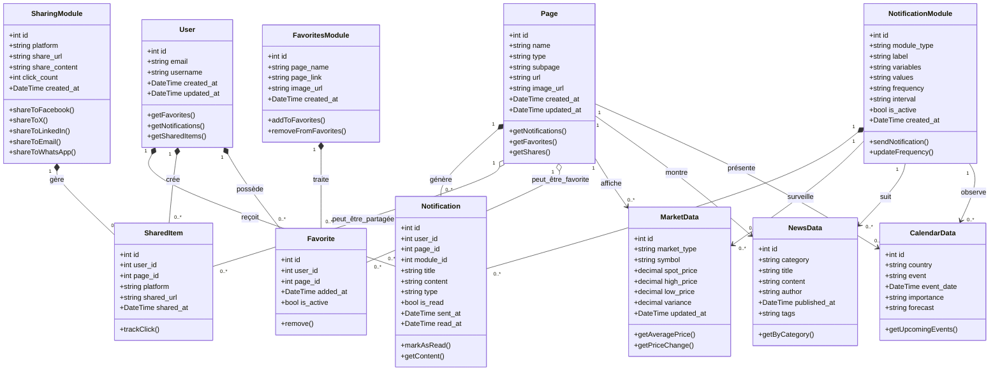

# Diagramme de Classes | Modèles et Relations

## Système de Notifications, Partage et Favoris pour Symfony 6.4

### Description des Relations

-   **User** : Utilisateur du système qui peut recevoir des notifications, partager du contenu et marquer des favoris
-   **Page** : Pages du système (Currency, Actions, Options, Cryptos, Metals, News, etc.)
-   **NotificationModule** : Gère les notifications avec différentes fréquences et intervalles
-   **SharingModule** : Gère le partage sur les réseaux sociaux et autres plateformes
-   **FavoritesModule** : Administre le système de favoris de l'utilisateur
-   **MarketData/NewsData/CalendarData** : Données spécifiques qui alimentent les notifications
