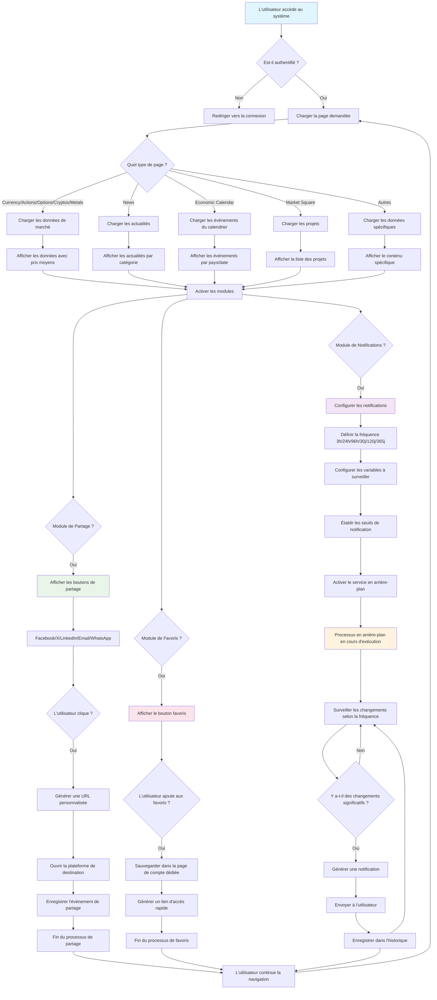

# Diagramme de Flux | Fonctionnalité Logique

## Flux Logique du Système de Notifications, Partage et Favoris

### Description du Flux

**Flux Principal :**

1. **Authentification** : Vérification de l'utilisateur
2. **Chargement de Page** : Détermination du type de contenu
3. **Chargement de Données** : Obtention d'informations spécifiques selon le type
4. **Activation des Modules** : Activation des fonctionnalités

**Module de Notifications :**

-   Configuration des fréquences (3h, 24h, 96h, 30j, 120j, 365j)
-   Surveillance continue en arrière-plan
-   Génération automatique de notifications

**Module de Partage :**

-   Support pour multiples plateformes
-   Suivi des clics et engagement
-   Génération d'URLs personnalisées

**Module de Favoris :**

-   Gestion dans une page de compte dédiée
-   Accès rapide au contenu favori
-   Persistance des préférences utilisateur
