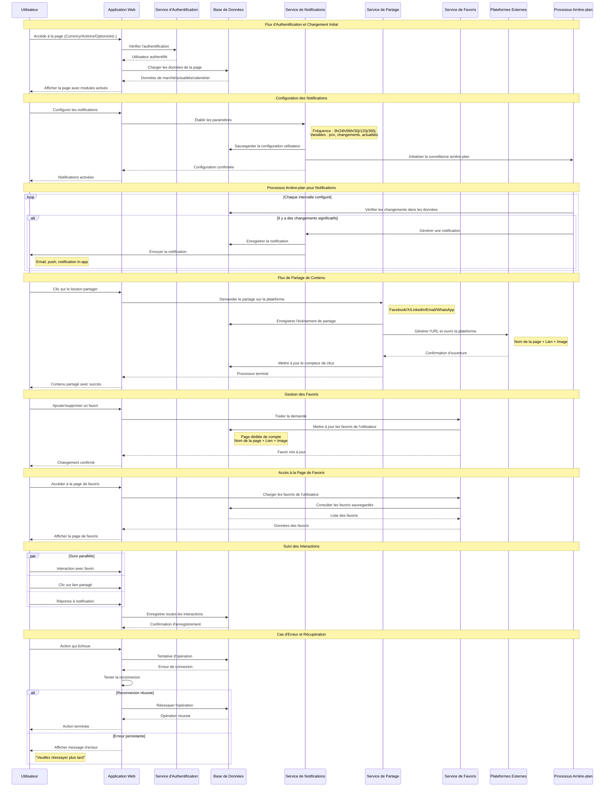

# Diagramme de Séquence | Flux d'Interaction

## Flux d'Interactions du Système de Notifications, Partage et Favoris

### Description des Interactions

**Acteurs Principaux :**

-   **Utilisateur** : Interagit avec l'application web
-   **Application Web** : Frontend qui gère les demandes
-   **Services** : Backend spécialisé par fonctionnalité
-   **Base de Données** : Stockage persistant
-   **Processus Arrière-plan** : Surveillance automatique
-   **Plateformes Externes** : Réseaux sociaux et services tiers

**Flux Clés :**

1. **Authentification et Chargement** : Vérification de l'utilisateur et chargement des données
2. **Notifications** : Configuration et envoi automatique
3. **Partage** : Intégration avec les plateformes sociales
4. **Favoris** : Gestion du contenu préféré
5. **Suivi** : Suivi des interactions
6. **Gestion des Erreurs** : Récupération en cas de défaillances
