# Graphique TD | Relations Simples Nœud-Nœud

## Relations Simples Nœud-Nœud du Système

```mermaid
graph TD
    %% Nœuds des Pages Principales
    A[Pages Currency]
    B[Pages Actions]
    C[Pages Options]
    D[Pages Cryptos]
    E[Pages Metals]
    F[Pages News]
    G[Calendrier Économique]
    H[Market Square]
    I[Fournisseur/Client]
    J[Informations Légales]
    K[Analyse Sectorielle]
    L[Indicateurs Financiers]
    M[Leaders]
    N[Commerce International]
    O[Aide au Développement]
    P[Indicateurs Pays]

    %% Nœuds des Modules Core
    Q[Module Notification]
    R[Module Partage]
    S[Module Favoris]

    %% Nœuds de Données
    T[Données Marché]
    U[Données Actualités]
    V[Données Calendrier]
    W[Données Entreprise]
    X[Données Commerce]
    Y[Données Financières]

    %% Nœuds Utilisateurs et Services
    Z[Compte Utilisateur]
    AA[Services Arrière-plan]
    BB[Plateformes Externes]
    CC[Base de Données]
    DD[Fournisseur de Service]

    %% Nœuds de Fréquences
    EE[3 Heures]
    FF[24 Heures]
    GG[96 Heures]
    HH[30 Jours]
    II[120 Jours]
    JJ[365 Jours]

    %% Relations Pages vers Modules
    A --> Q
    A --> R
    A --> S
    B --> Q
    B --> R
    B --> S
    C --> Q
    C --> R
    C --> S
    D --> Q
    D --> R
    D --> S
    E --> Q
    E --> R
    E --> S
    F --> Q
    F --> R
    F --> S
    G --> Q
    G --> R
    G --> S
    H --> Q
    H --> R
    H --> S
    I --> Q
    I --> R
    I --> S
    J --> Q
    J --> R
    J --> S
    K --> Q
    K --> R
    K --> S
    L --> Q
    L --> R
    L --> S
    M --> Q
    M --> R
    M --> S
    N --> Q
    N --> R
    N --> S
    O --> Q
    O --> R
    O --> S
    P --> Q
    P --> R
    P --> S

    %% Relations Données vers Pages
    T --> A
    T --> B
    T --> C
    T --> D
    T --> E
    U --> F
    V --> G
    W --> H
    W --> I
    W --> J
    Y --> K
    Y --> L
    W --> M
    X --> N
    Y --> O
    Y --> P

    %% Relations Modules vers Services
    Q --> AA
    Q --> CC
    R --> BB
    R --> DD
    S --> Z
    S --> CC

    %% Relations Fréquences vers Notifications
    EE --> Q
    FF --> Q
    GG --> Q
    HH --> Q
    II --> Q
    JJ --> Q

    %% Relations Utilisateur
    Z --> Q
    Z --> R
    Z --> S
    Z --> CC

    %% Relations Services Arrière-plan
    AA --> T
    AA --> U
    AA --> V
    AA --> W
    AA --> X
    AA --> Y

    %% Relations Plateformes Externes
    BB --> KK[Facebook]
    BB --> LL[X/Twitter]
    BB --> MM[LinkedIn]
    BB --> NN[Email]
    BB --> OO[WhatsApp]

    %% Styles des Nœuds
    classDef pageNode fill:#e3f2fd,stroke:#1976d2,stroke-width:2px
    classDef moduleNode fill:#f3e5f5,stroke:#7b1fa2,stroke-width:2px
    classDef dataNode fill:#e8f5e8,stroke:#388e3c,stroke-width:2px
    classDef serviceNode fill:#fff3e0,stroke:#f57c00,stroke-width:2px
    classDef frequencyNode fill:#fce4ec,stroke:#c2185b,stroke-width:2px
    classDef platformNode fill:#e0f2f1,stroke:#00695c,stroke-width:2px

    %% Appliquer les styles
    class A,B,C,D,E,F,G,H,I,J,K,L,M,N,O,P pageNode
    class Q,R,S moduleNode
    class T,U,V,W,X,Y dataNode
    class Z,AA,BB,CC,DD serviceNode
    class EE,FF,GG,HH,II,JJ frequencyNode
    class KK,LL,MM,NN,OO platformNode

    %% Sous-graphiques pour organisation
    subgraph "Pages Marché"
        A
        B
        C
        D
        E
    end

    subgraph "Pages Information"
        F
        G
        H
        I
    end

    subgraph "Pages Analyse"
        J
        K
        L
        M
        N
        O
        P
    end

    subgraph "Modules Core"
        Q
        R
        S
    end

    subgraph "Sources de Données"
        T
        U
        V
        W
        X
        Y
    end

    subgraph "Services Système"
        Z
        AA
        BB
        CC
        DD
    end

    subgraph "Fréquences Notification"
        EE
        FF
        GG
        HH
        II
        JJ
    end

    subgraph "Plateformes Sociales"
        KK
        LL
        MM
        NN
        OO
    end
```

### Description des Relations Nœud-Nœud

**Relations Principales :**

1. **Pages → Modules** : Toutes les pages du système se connectent aux trois modules core (Notifications, Partage, Favoris)

2. **Données → Pages** : Différents types de données alimentent des pages spécifiques :

    - Données Marché → Currency, Actions, Options, Cryptos, Metals
    - Données Actualités → Pages News
    - Données Calendrier → Calendrier Économique
    - Données Entreprise → Market Square, Fournisseur/Client, Infos Légales, Leaders
    - Données Financières → Analyse Sectorielle, Indicateurs Financiers, Aide au Développement, Indicateurs Pays
    - Données Commerce → Commerce International

3. **Modules → Services** :

    - Module Notification → Services Arrière-plan + Base de Données
    - Module Partage → Plateformes Externes + Fournisseur de Service
    - Module Favoris → Compte Utilisateur + Base de Données

4. **Fréquences → Notifications** : Six intervalles de temps différents se connectent au module de notifications

5. **Utilisateur → Système** : L'utilisateur se connecte à tous les modules et à la base de données

6. **Services Arrière-plan → Données** : Les services arrière-plan surveillent tous les types de données

7. **Plateformes Externes** : Facebook, X, LinkedIn, Email, WhatsApp se connectent via le module de partage

**Caractéristiques du Graphique :**

-   **Nœuds de Pages** (bleu) : 16 types différents de pages
-   **Nœuds de Modules** (violet) : 3 modules core du système
-   **Nœuds de Données** (vert) : 6 types de sources de données
-   **Nœuds de Services** (orange) : 5 services du système
-   **Nœuds de Fréquences** (rose) : 6 intervalles de notification
-   **Nœuds de Plateformes** (sarcelle) : 5 plateformes sociales/communication
